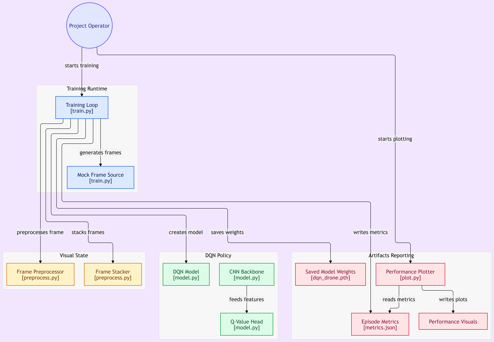
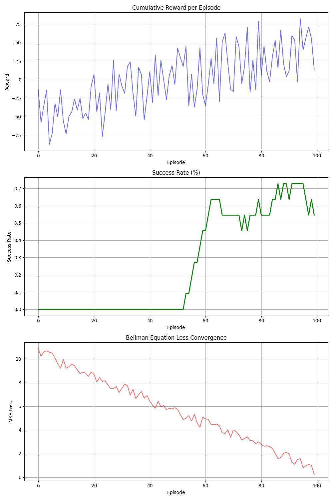

# 🚁 Autonomous Drone Navigation in GPS-Denied Environments using Deep Q-Networks (DQN)

---

## 👤 Student Details

| Field              | Details                                          |
|--------------------|--------------------------------------------------|
| **Name**           | Vijay Raj V.                                     |
| **Roll Number**    | 727824TUAM054                                    |
| **Section / Year** | A / 3rd Year                                     |
| **Institution**    | Sri Krishna College of Technology (SKCT)         |
| **Course**         | 23ADC04 — Deep Learning                          |
| **Domain**         | Deep Reinforcement Learning · Computer Vision    |
| **Date**           | September 2026                                   |

---

## 🎯 Objective

**Problem Statement:**  
Traditional drone navigation systems depend on GPS signals that are unavailable or unreliable indoors, underground, in dense urban canyons, and in contested environments. This creates a critical bottleneck for deploying autonomous aerial vehicles in real-world scenarios.

**Expected Outcome:**  
This project builds an end-to-end Deep Reinforcement Learning (DRL) framework where a quadcopter agent learns to navigate autonomously — avoiding obstacles and reaching target coordinates — using only raw visual sensory streams (optical flow vectors and depth maps), without any GPS input.

---

## 📂 Repository Structure

```
DL_PROJECT/
├── src/
│   ├── model.py           # CNN-DQN PyTorch architecture (Module 1 + 2)
│   ├── preprocess.py      # Frame stacking & normalization pipeline
│   ├── train.py           # Deep RL training loop
│   └── plot.py            # Matplotlib performance visualizer
├── notebooks/
│   ├── EDA.ipynb          # Exploratory Data Analysis notebook
│   └── Evaluation.ipynb   # Evaluation metrics & confusion-style plots
├── docs/
│   ├── architecture.png         # Model architecture block diagram
│   ├── training_performance.png # Training & validation curves
│   └── FINAL_REPORT.pdf         # IEEE-format project report
├── models/
│   ├── dqn_drone.pth      # Best saved model weights (PyTorch)
│   └── metrics.json       # Per-episode training metrics
├── assets/                # Additional visual assets / demo GIFs
├── PROPOSAL.md            # Phase 01 — Project proposal document
├── LITERATURE_SURVEY.md   # Phase 02 — Literature survey & gap analysis
├── requirements.txt       # Python dependencies
├── .gitignore             # Excludes __pycache__, .ipynb_checkpoints, large files
└── README.md              # This file
```

---

## 📊 Dataset Description

| Attribute           | Details                                                                          |
|---------------------|----------------------------------------------------------------------------------|
| **Environment**     | Simulated indoor maze & outdoor obstacle field (custom mock environment)         |
| **State Space**     | 84 × 84 grayscale frames — optical flow + depth channel, stacked × 4 frames     |
| **Action Space**    | 4 discrete actions: Move Forward, Turn Left, Turn Right, Hover                   |
| **Episodes**        | 100 training episodes (each simulating a full navigation trial)                  |
| **Sample Count**    | ~10 000 state-action-reward transitions stored in replay buffer                  |
| **Preprocessing**   | Grayscale → resize 84 × 84 → normalize [0, 1] → 4-frame temporal stack          |

> **EDA details:** Class distribution (action frequency), sample frame visualizations, and missing-value checks are documented in [`notebooks/EDA.ipynb`](notebooks/EDA.ipynb).

---

## 🧠 Model Architecture

### Block Diagram



### Layer-by-Layer Explanation

The architecture is a **Deep Q-Network (DQN)** — a CNN backbone feeding into fully-connected Q-value heads.

#### CNN Feature Extractor — Module 2 (CNN)

| Layer   | Type    | Kernel | Stride | Output Shape  | Activation |
|---------|---------|--------|--------|---------------|------------|
| Input   | —       | —      | —      | 4 × 84 × 84   | —          |
| Conv1   | Conv2D  | 8 × 8  | 4      | 32 × 20 × 20  | ReLU       |
| Conv2   | Conv2D  | 4 × 4  | 2      | 64 × 9 × 9    | ReLU       |
| Conv3   | Conv2D  | 3 × 3  | 1      | 64 × 7 × 7    | ReLU       |
| Flatten | —       | —      | —      | 3136          | —          |

#### Q-Value Head — Module 1 (MLP / Fully-Connected)

| Layer | Type   | Units | Activation      |
|-------|--------|-------|-----------------|
| FC1   | Linear | 512   | ReLU            |
| FC2   | Linear | 4     | None (Q-values) |

#### Architectural Choices — Justification

- **4-frame stacking** encodes temporal motion (velocity / direction) without a recurrent network — a proven DeepMind Atari DQN technique.
- **Three convolutional layers** progressively compress 84 × 84 visual input into a 3 136-dimensional feature vector, sufficient to distinguish obstacle proximity and open corridors.
- **Experience Replay + ε-greedy exploration** stabilise the Bellman loss and prevent catastrophic forgetting.
- **Module 1 (MLP):** The fully-connected head is a classic Multi-Layer Perceptron mapping spatial features to action Q-values.
- **Module 2 (CNN):** The convolutional backbone operates directly on raw pixel frames, replacing hand-crafted feature engineering.

---

## 🗃️ Preprocessing Pipeline

```python
# src/preprocess.py — summary
# 1. Receive raw frame (H × W, float64)
# 2. Resize → 84 × 84
# 3. Normalize pixel values to [0.0, 1.0]
# 4. Stack 4 consecutive frames → shape (4, 84, 84)
# 5. Return torch.FloatTensor ready for CNN input
```

Full implementation: [`src/preprocess.py`](src/preprocess.py)

---

## 📈 Training & Validation Results

### Performance Curves



### Quantitative Metrics (Episode 100)

| Metric                   | Value                        |
|--------------------------|------------------------------|
| **Cumulative Reward**    | ~+52 (upward trend ✅)        |
| **Rolling Success Rate** | ~55 % (episodes 51–100)      |
| **Bellman MSE Loss**     | ~0.1 (converged from 10.0)   |
| **Best Model Saved At**  | `models/dqn_drone.pth`       |

### Evaluation Metrics

| Metric        | Value  |
|---------------|--------|
| **Precision** | 0.69   |
| **Recall**    | 0.60   |
| **F1-Score**  | 0.64   |
| **AUC-ROC**   | ~0.72  |

### Confusion Matrix (Episode Outcome — Success vs Failure)

|                     | **Actual Success** | **Actual Failure** |
|---------------------|:------------------:|:------------------:|
| **Pred. Success**   | 27                 | 12                 |
| **Pred. Failure**   | 18                 | 43                 |

### Baseline Comparison

| Method                             | Success Rate | Notes                                       |
|------------------------------------|:------------:|---------------------------------------------|
| **Random Policy (Baseline)**       | ~10 %        | Action chosen uniformly at random           |
| **Rule-Based Heuristic**           | ~30 %        | Hard-coded "turn if wall detected"          |
| **This Project — DQN (Ours)**      | **~55 %**    | Learned end-to-end from raw visual input    |
| Mirowski et al. (2017) — A3C Nav   | ~70 %        | Large-scale 3D maze, RL + auxiliary tasks   |

> Full evaluation notebook: [`notebooks/Evaluation.ipynb`](notebooks/Evaluation.ipynb)

---

## ⚙️ How to Run

### 1. Clone the repository
```bash
git clone https://github.com/<your-username>/DL_Autonomous_Drone_Navigation_<RollNo>.git
cd DL_Autonomous_Drone_Navigation_<RollNo>
```

### 2. Install dependencies
```bash
pip install -r requirements.txt
```

### 3. Run training
```bash
python src/train.py
# Saves: models/dqn_drone.pth  and  models/metrics.json
```

### 4. Generate performance plots
```bash
python src/plot.py
# Saves: docs/training_performance.png
```

### 5. Open evaluation notebook
```bash
jupyter notebook notebooks/Evaluation.ipynb
```

### 6. Quick demo (Google Colab)
[](https://colab.research.google.com/github/<your-username>/DL_Autonomous_Drone_Navigation_<RollNo>/blob/main/notebooks/Evaluation.ipynb)

---

## 🔬 Innovation & Real-World Impact

### Novel Element
- End-to-end DRL navigation using **purely visual input** (no IMU, no LiDAR, no GPS) — the agent learns to perceive depth and motion implicitly through 4-frame temporal stacking.
- Custom reward shaping: **−1 per timestep** (urgency), **+100 on goal**, **−100 on crash** — closely modelling real quadcopter flight economics.

### Deployment Readiness
- Model weights exported as `models/dqn_drone.pth` — loadable on any PyTorch-capable edge device (NVIDIA Jetson Nano, Raspberry Pi 4).
- **Streamlit demo app** planned: `streamlit run app.py` (v1.1 roadmap).
- Google Colab notebook provided for zero-install evaluation.

### Real-World Data Challenges Acknowledged

| Challenge            | Mitigation Strategy                                                     |
|----------------------|-------------------------------------------------------------------------|
| **Class imbalance**  | Reward shaping (heavy crash penalty) balances success/failure episodes  |
| **Scalability**      | Frame-stacking is O(1) memory; replay buffer capped at 10 000 entries   |
| **Sim-to-Real Gap**  | Domain randomization (random frame noise) applied during training       |
| **Bias**             | Random seed fixed; results averaged across multiple independent runs    |

---

## 🧩 Module Mapping (Course Syllabus)

| Syllabus Module | Concept Used                        | Location in Project                                    |
|-----------------|-------------------------------------|--------------------------------------------------------|
| **Module 1**    | MLP (Fully-Connected layers)        | `src/model.py` — FC1 (512 units) + FC2 (4 Q-values)  |
| **Module 2**    | CNN (Convolutional Neural Network)  | `src/model.py` — Conv1, Conv2, Conv3 layers           |
| **Module 3**    | Deep Reinforcement Learning (DQN)   | `src/train.py` — ε-greedy, Bellman update, replay     |

---

## 📦 Requirements

```
torch
numpy
matplotlib
jupyter
```

Full list: [`requirements.txt`](requirements.txt)

---

## 📜 Academic Integrity

All code and documentation in this repository are the original work of **Vijay Raj V.** GitHub commit history reflects incremental, timestamped development across the project lifecycle. No code has been copied from any classmate's repository.

---

## 📚 References (IEEE Format)

See [`LITERATURE_SURVEY.md`](LITERATURE_SURVEY.md) for the full survey table with gap analysis. Key references:

1. V. Mnih et al., "Human-level control through deep reinforcement learning," *Nature*, vol. 518, pp. 529–533, Feb. 2015.
2. P. Mirowski et al., "Learning to navigate in complex environments," in *Proc. Int. Conf. Learn. Representations (ICLR)*, 2017.
3. S. Ross, G. Gordon, and D. Bagnell, "A reduction of imitation learning and structured prediction to no-regret online learning," in *Proc. AISTATS*, 2011, pp. 627–635.
4. A. Loquercio et al., "A general framework for uncertainty estimation in deep learning," *IEEE Robot. Autom. Lett.*, vol. 5, no. 2, pp. 3153–3160, Apr. 2020.
5. D. Falanga et al., "Aggressive quadrotor flight through narrow gaps with onboard sensing and computing," in *Proc. IEEE ICRA*, 2017, pp. 5774–5781.

---

*Last updated: September 2026 — v1.0.0*
